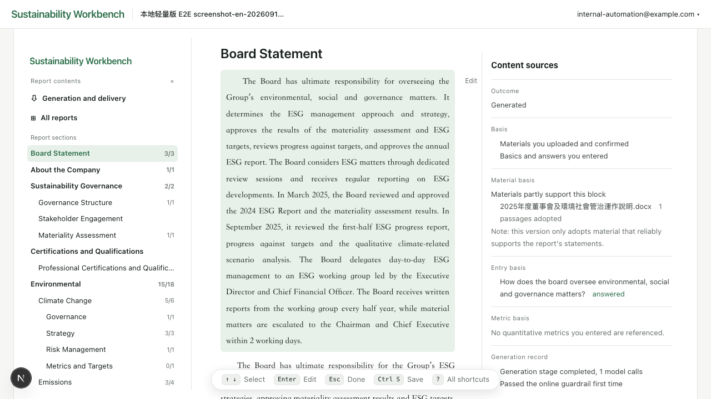
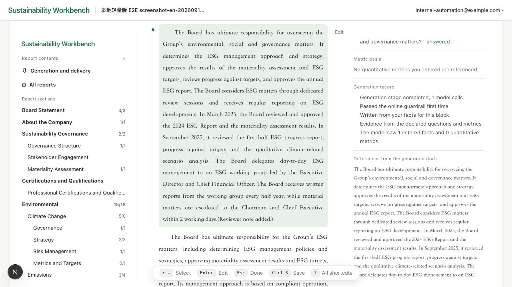
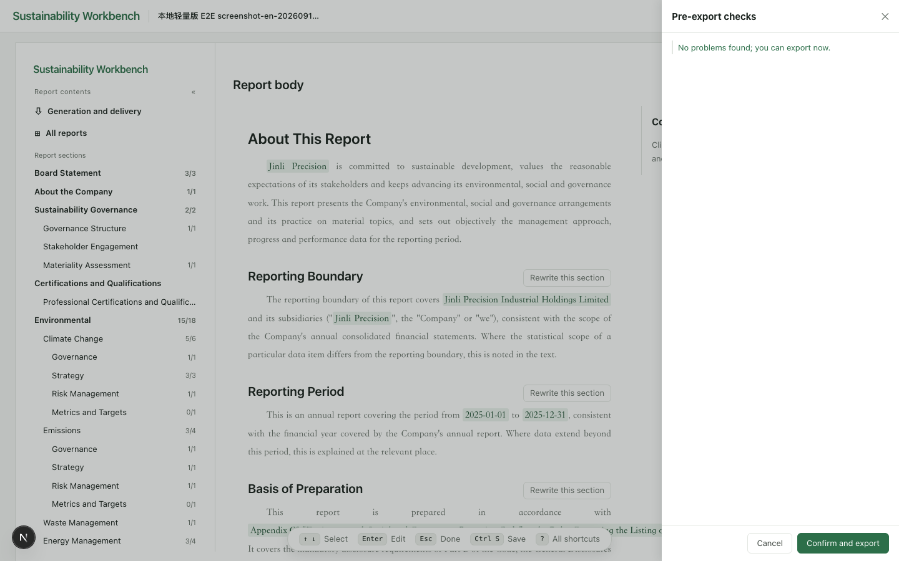

# Sustainability Workbench

**Open-source, self-hosted AI drafting for ESG and sustainability reports — HKEX and China A-share
disclosure rules, exported to Word.**

**English** · [简体中文](./README.zh-CN.md) · [Setup](./SETUP.md) ·
[Architecture](./docs/architecture.md) · [Handbook](./docs/handbook/README.md) (Chinese)

Sustainability Workbench is an open-source (MIT) web application that drafts ESG and sustainability
reports with large language models (LLMs) and exports them to Word (.docx). It writes section by
section against a disclosure standard — the HKEX Environmental, Social and Governance Reporting
Code, or the sustainability reporting guidelines of the Shanghai, Shenzhen and Beijing stock
exchanges — drafting from the company information, metrics and documents you provide, and it shows
which of your files and answers each block of text drew on. It runs on your own machine, with Azure
OpenAI or any OpenAI-compatible model, including one you host yourself.

It is built for the people who prepare these reports: in-house reporting teams at companies of any
size, and the consultants and accounting firms who do it on their behalf.



*Generated prose with its sources on the right — which uploaded file supported this block, which
questions you answered, and what the generation run did.*

It drafts; it does not assure. What comes out is a draft for professional review — not an
assurance opinion, not a compliance guarantee. Someone still has to read it and sign it off.

## Supported disclosure standards

Rules and language live in **knowledge packages** — one package per rule set per language. You pick
one when you create a report.

| Package / language | Standard |
|---|---|
| `hkex_en`<br>English | HKEX Listing Rules [Appendix C2, *Environmental, Social and Governance Reporting Code*](https://en-rules.hkex.com.hk/rulebook/appendix-c2-environmental-social-and-governance-reporting-code-0) — the version effective 1 January 2025, including the Part D climate-related disclosures |
| `hkex_zh_hant`<br>Traditional Chinese | 香港聯合交易所《證券上市規則》[附錄 C2《環境、社會及管治報告守則》](https://cn-rules.hkex.com.hk/%E8%A6%8F%E5%89%87%E6%89%8B%E5%86%8A/%E9%99%84%E9%8C%84-c2-%E3%80%8A%E7%92%B0%E5%A2%83%E3%80%81%E7%A4%BE%E6%9C%83%E5%8F%8A%E7%AE%A1%E6%B2%BB%E5%A0%B1%E5%91%8A%E5%AE%88%E5%89%87%E3%80%8B) — the same Code, with the same structure as `hkex_en` |
| `sse_zh_hans`<br>Simplified Chinese | [Shanghai Stock Exchange Self-Regulatory Guidelines for Listed Companies No. 14 — Sustainability Report (Trial)](https://www.sse.com.cn/lawandrules/sselawsrules2025/stocks/mainipo/c/c_20250516_10779150.shtml) (《上海证券交易所上市公司自律监管指引第14号——可持续发展报告（试行）》). A company listed in Shenzhen or Beijing names its own exchange's guideline — SZSE No. 17 or BSE No. 11 — as the basis instead |

The exchange standards serve as the structure whether or not you are listed. Adding an exchange or
a language means adding a package, not changing the generation pipeline.

A fourth package, for the GRI Standards, is present but sealed: it is not selectable when creating
a report. It was built against a route that needs wording changes before it can honestly claim
conformance.

## When it fits, and when it doesn't

It fits if you are:

- an HKEX-listed issuer preparing its annual ESG report, including the Part D climate-related
  disclosures;
- an A-share company listed in Shanghai, Shenzhen or Beijing preparing a sustainability report
  under its exchange's guideline, whether that report is mandatory for you or voluntary;
- an unlisted company whose customer, bank or tender has asked for an ESG report — plenty of
  companies write one for that reason rather than because a regulator did;
- a consultant or accounting firm preparing drafts for clients.

It does not fit if you need:

- a report under CSRD / ESRS, or one prepared "in accordance with" the GRI Standards;
- carbon accounting — it takes the emission figures you enter, Scope 1, 2 and 3 included, but does
  not calculate emissions from activity data;
- an assurance opinion or a compliance sign-off;
- a hosted or multi-user service — it is a single-user application for your own machine.

## Why not just hand the files to ChatGPT or another LLM

A sustainability report is constrained by the standard it follows: which topics must be
covered, what each topic has to disclose, which metrics need numbers. Handing every file to a
model and asking for a report fails in two places — it writes things the company never did, and
it misses disclosures the standard requires.

Two constraints address that:

- **Agents select material; they don't write prose.** A File Agent reads each document into a
  summary; a Mapping Agent decides which materials a given chapter may draw on. Neither produces
  report text. Prose is generated block by block, and each block only sees the facts assigned to
  it.
- **A deterministic gate stands before delivery.** Code — not a model — checks completeness and
  consistency, and blocks the export with the location of anything that fails. The same report
  always gets the same verdict.

This is a workbench, not a one-click ESG report generator: you read the draft, revise it paragraph
by paragraph, rewrite whole sections, and decide when it ships.

## How it works

Five preparation steps, then generate:

1. **Company basics** (required) — company, reporting period and, for A-share reports, which
   exchange's guideline is the basis
2. **Materiality assessment** — decides which topics enter the report; the A-share package scores
   financial and impact materiality separately (double materiality)
3. **Quantitative metrics** — each with its unit and definition: greenhouse gas emissions, energy,
   water, waste, workforce, health and safety, training, supply chain, anti-corruption and more
4. **Guided topic questions**
5. **Document upload** — policies, records and certificates as PDF, Word, Excel or PowerPoint
   files (scanned PDFs need the optional OCR component)

The last four can be left empty. After generation you get two Word files: a final version, and a
review version carrying annotations about what still needs human confirmation.

The repository ships a fully synthetic corpus — two fictional companies, no real business data —
so you can run the whole flow end to end without supplying anything of your own.

Edit any paragraph in place. The green dot marks what you changed, and the panel shows the
difference from the generated draft:



Before export, a deterministic gate — no model involved — lists what still needs attention:



## Architecture

```
Your input
├─ Company basics (name, reporting period)          ┐
├─ Topic materiality scoring (what enters the report)├─────────────┐
├─ Quantitative metrics (emissions, workforce, waste)┘             │
└─ Documents (policies, records, certificates)                     │
        │                                                          │
        ▼                                                          │
   File Agent            material.file_agent                       │
   reads each file → traceable dossier                             │
        │                                                          │
        ▼                                                          │
   Mapping Agent         material.mapping_agent                    │
   picks material per chapter; selects, never writes               │
        │                                                          ▼
   ┌──────────────────────────────────────────────────────────────────┐
   │ Controlled evidence set — each block sees only its assigned facts │
   └──────────────────────────────────────────────────────────────────┘
        │
        ▼
   Block-by-block drafting   generation.blocks → generation.commit
        │                            ▲
        ▼                            │ blocking issue → back for revision
   Diagnostic gate           delivery.export_gate
        │
        ▼
   Final + review Word       delivery.docx.word / .review
```

Paragraph-by-paragraph revision is optional and sits between drafting and the gate. Of the four
inputs only company basics is required; the rest may be left empty, and the system adjusts what
it writes rather than inventing filler.

Full detail in [docs/architecture.md](./docs/architecture.md).

## FAQ

### Is it free?

Yes. The code is MIT-licensed. What you pay for is model usage — your API provider's charges, or
your own hardware if you run the model yourself.

### Which models does it work with?

Azure OpenAI by default. Any OpenAI-compatible endpoint works without code changes, including a
self-hosted vLLM or Ollama server, and DeepSeek, Qwen, GLM and Kimi (Moonshot) are registered out
of the box. Output quality depends on the model you choose. See [SETUP.md](./SETUP.md).

### Does my data leave my machine?

Report data — the database, sign-in, uploaded files and exported documents — stays on your
machine. The exception is the model: the text each drafting step needs is sent to the endpoint you
configure. With a model running on your own machine, none of it leaves.

### Does it support GRI, ISSB or CSRD?

Not as a reporting basis. The HKEX packages follow the Code's Part D, whose climate-related
disclosures are structured after IFRS S2, but there is no standalone ISSB (IFRS S1 / S2) package
and no CSRD / ESRS package. The GRI package is sealed, as described above.

### Can it write a report with no documents uploaded?

Yes. Only company basics are required. Where materials or answers are missing, it adjusts what it
writes rather than inventing filler, and the review version marks what still needs confirmation.

### Is there a hosted version?

No. It is self-hosted only, and it is not built to be exposed to a public network.

### Can I add another exchange, standard or language?

Yes — by adding a knowledge package; the generation pipeline stays as it is. See
[docs/architecture.md](./docs/architecture.md).

## Getting started

See [SETUP.md](./SETUP.md). Short version, once the prerequisites are installed:

```bash
make supabase-up                        # local Postgres + auth
cp backend/.env.example backend/.env    # fill from `supabase status`, add a model API key
make verify                             # backend and frontend tests
./scripts/dev/local-acceptance-stack.sh up   # starts backend, worker and frontend
```

Prerequisites: Node 22, uv, Docker and the Supabase CLI — plus LibreOffice if you want table-of-
contents page numbers computed at export time rather than by the reader. `make doctor` requires the
four, and notes the optional ones.

**Set aside about 2.5 GB and 10–15 minutes.** The repository is small (~13 MB), but the container
images and dependency trees are not, and most of that lands outside the project directory.
[SETUP.md](./SETUP.md) breaks the figure down and lists the three optional components —
LibreOffice, OCR and the Playwright browsers — that you can skip.

Supabase here is **not a cloud account** — it runs Postgres and auth in local Docker containers
on your own machine. What the database holds never leaves it, and there is nothing to sign up
for.

## For coding agents

Run these in order. Each step either succeeds or fails loudly; do not skip ahead.

```bash
make doctor                                  # verifies Node 22+, uv, Docker, Supabase CLI
make supabase-up                             # must finish before any test run
cp backend/.env.example backend/.env         # then fill JWT_SECRET, SERVICE_ROLE_KEY, ANON_KEY from `supabase status`
                                             # and one model key (Azure OpenAI, or any OpenAI-compatible endpoint)
make verify                                  # backend pytest + frontend test/lint/build
make install-hooks                           # pre-push runs make verify
```

Then create the first account and start the stack:

```bash
make provision-owner ARGS="--email you@example.com"        # dry run: prints what it would do
SUSTAINABILITY_DESK_OWNER_PASSWORD='<12+ chars, mixed case and digits>' \
SUSTAINABILITY_DESK_CONFIRM_PROVISION_OWNER=YES \
  make provision-owner ARGS="--email you@example.com --apply"
./scripts/dev/local-acceptance-stack.sh up   # backend :8010, worker, frontend :3000
```

Four things that will waste your time if you do not know them:

- **`make verify` before `make supabase-up` gives a false green.** Persistence tests call
  `pytest.skip` when the database is unreachable, so the suite passes without ever exercising
  the database layer. Start the stack first.
- **The worker is not optional.** Material processing and report generation are Postgres queues
  consumed by a separate process. Without it the UI works and generation waits forever.
- **LibreOffice is optional.** Without it the table of contents still works; its page numbers are
  resolved by whatever opens the document rather than fixed at export.
- **Open `http://localhost:3000`, not `127.0.0.1`.** The Next dev server rejects other origins
  and the page stalls on an auth error.

No account can be created from the UI — sign-up is deliberately closed, so
`make provision-owner` is the only path to the first login.

Working on the code: read [CLAUDE.md](./CLAUDE.md) first (rules, invariants, what not to
change), then [docs/architecture.md](./docs/architecture.md). `AGENTS.md` is a byte-identical
copy for tools that look for that name.

Verify a change end to end without calling any model:

```bash
cd backend && uv run pytest tests/test_local_e2e_fixture_corpora.py
```

It drives the built-in synthetic corpus through the real input path and renders a Word file.

## Stack

| Layer | What |
|---|---|
| Backend | Python / FastAPI, Postgres queue with a separate worker |
| Frontend | Next.js |
| Storage & auth | Supabase (Postgres + Auth); uploaded files and deliverables stay on local disk |
| Export | python-docx for rendering; LibreOffice optionally pre-computes TOC page numbers |
| Models | Azure OpenAI by default; any OpenAI-compatible endpoint works without code changes |

## License

MIT. See [LICENSE](./LICENSE).

Generation quality depends on calibration, and calibration is specific to each firm's house
style and review standards. If you want help building an evaluation setup for your own
reports, or AI engineering support more broadly, get in touch — Dexter Yao,
dexter.yao23@gmail.com

Clause numbers and metric names are cited as fact; the wording of disclosure requirements is
rewritten rather than copied from official texts.
