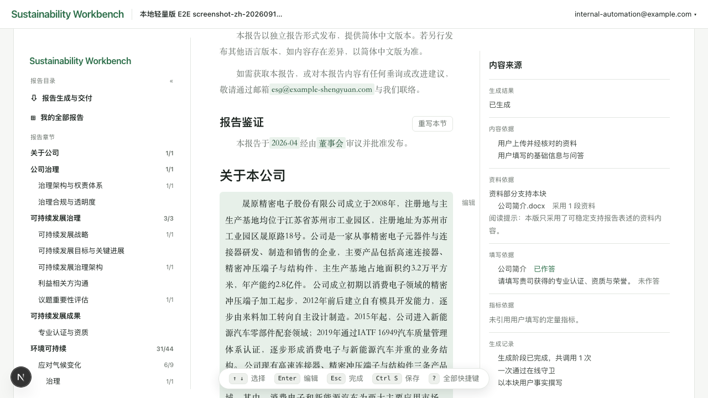
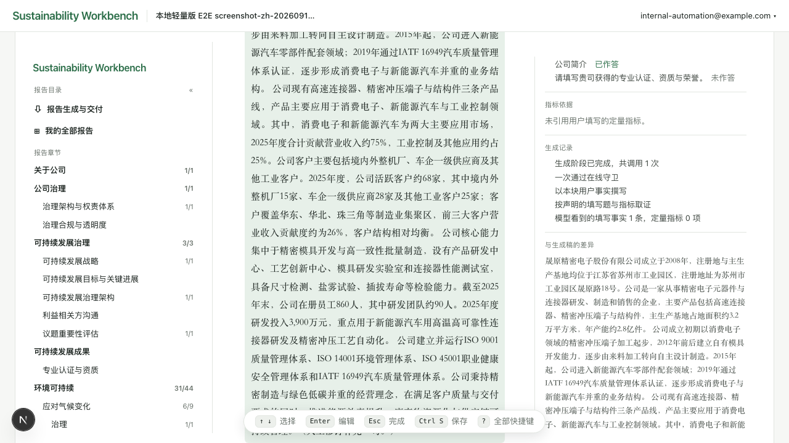
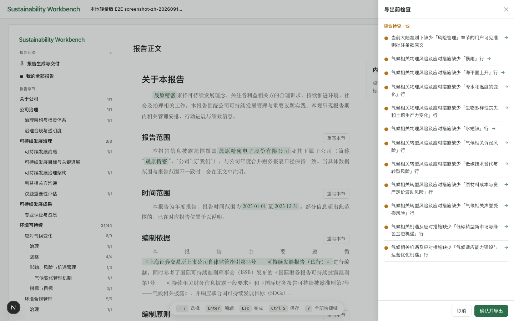

# Sustainability Workbench

**开源、本机部署的 ESG 报告 / 可持续发展报告 AI 编制工具——按港交所与沪深北交易所的披露准则
分章节起草，导出 Word。**

**[English](./README.md)** · [架构说明](./docs/architecture.zh-CN.md) ·
[安装配置](./SETUP.zh-CN.md) · [用户手册](./docs/handbook/README.md)

Sustainability Workbench 是一个开源（MIT）的 Web 应用，用大语言模型起草 ESG 报告（可持续发展
报告）并导出 Word（.docx）。它按一套披露准则分章节起草——港交所《环境、社会及管治报告守则》，
或上交所、深交所、北交所的可持续发展报告指引——依据你提供的企业信息、指标数据与资料文件写作，
并标出每一块正文用了你的哪些文件和答案。它在你自己的电脑上运行，模型可用 Azure OpenAI，
也可接任何 OpenAI 兼容接口，包括 DeepSeek、通义千问等国内模型和自己部署的模型。

面向报告的编制者——各类规模企业内部的报告团队，以及代其编制的咨询机构与会计师事务所。



*生成的正文，右栏是它的来源——这一块用了哪份上传资料、哪些填写题，以及那次生成做了什么。*

它起草，不做鉴证。产出是供专业人员复核的草稿，不是鉴证意见，也不构成合规保证；
最终仍要有人读过并签字负责。

## 支持的披露准则

准则与语言由**知识包**承载，一个包对应一套准则和一种语言，建报时选一个。

| 知识包 / 语言 | 准则 |
|---|---|
| `sse_zh_hans`<br>简体中文 | [《上海证券交易所上市公司自律监管指引第14号——可持续发展报告（试行）》](https://www.sse.com.cn/lawandrules/sselawsrules2025/stocks/mainipo/c/c_20250516_10779150.shtml)。深交所、北交所上市公司改以本所指引——《深圳证券交易所上市公司自律监管指引第17号——可持续发展报告（试行）》或《北京证券交易所上市公司持续监管指引第11号——可持续发展报告（试行）》——作为编制依据 |
| `hkex_zh_hant`<br>繁體中文 | 香港联合交易所《证券上市规则》[附录 C2《环境、社会及管治报告守则》](https://cn-rules.hkex.com.hk/%E8%A6%8F%E5%89%87%E6%89%8B%E5%86%8A/%E9%99%84%E9%8C%84-c2-%E3%80%8A%E7%92%B0%E5%A2%83%E3%80%81%E7%A4%BE%E6%9C%83%E5%8F%8A%E7%AE%A1%E6%B2%BB%E5%A0%B1%E5%91%8A%E5%AE%88%E5%89%87%E3%80%8B)，2025 年 1 月 1 日起生效的版本，含 D 部分气候相关披露 |
| `hkex_en`<br>英文 | 同一守则的英文版 [Appendix C2 *Environmental, Social and Governance Reporting Code*](https://en-rules.hkex.com.hk/rulebook/appendix-c2-environmental-social-and-governance-reporting-code-0)，结构与 `hkex_zh_hant` 一致 |

无论是否上市，这些准则都可以作为报告的结构依据。加一个交易所或一种语言是加一个包，不改生成链路。

仓库里还有第四个包 GRI，已封存，建报时不可选：它依据的路线要求先改动措辞，否则不能诚实地
声称符合该准则。

## 适合谁，不适合谁

适合：

- 港交所上市公司，编制年度 ESG 报告（环境、社会及管治报告），含 D 部分气候相关披露；
- 沪深北 A 股上市公司，按所在交易所的指引编制可持续发展报告，无论是强制披露还是自愿披露；
- 没有上市、但客户、银行或投标方要求提供 ESG 报告的企业——很多企业写这份报告正是因为这个，
  而不是监管要求；
- 为客户起草报告的咨询机构与会计师事务所。

不适合：

- 按 CSRD / ESRS 编制，或声称「依据 GRI 标准编制」（in accordance with）的报告；
- 碳核算——它接收你填入的排放数据（含范围一、二、三），但不根据活动数据计算排放量；
- 鉴证意见或合规结论；
- 在线托管或多人协作——它是在你自己电脑上运行的单用户应用。

## 为什么不是「把文件丢给 ChatGPT 或别的大模型写一份」

可持续发展报告受其所依据的准则约束：哪些议题必须写、每个议题要披露什么、哪些指标要给
数字。直接让大模型读完所有文件写一份，会在两个地方出错——写出企业没做过的事，以及漏掉准则
要求披露的内容。

用两条约束来处理：

- **Agent 只选材料，不写正文。** File Agent 读懂每份文件形成摘要，Mapping Agent 决定某个章节
  可以用哪几份材料，两者都不产出报告文字。正文逐块生成，每个块只看见分配给它的事实。
- **出稿前有一道不调用模型的诊断闸。** 用代码检查完整性与一致性，有阻断级问题就拦下并指出
  位置。同样的报告永远得到同样的判断。

它是工作台，不是一键生成 ESG 报告的工具：你读草稿、逐段修订、按章节重写，由你决定什么时候定稿。

## 怎么用

五步准备，然后生成：

1. **企业基本信息**（必填）——公司、报告期间；沪深北报告还要选以哪家交易所的指引为编制依据
2. **议题重要性评估**——决定哪些议题进报告；沪深北知识包分别评估财务重要性与影响重要性（双重重要性）
3. **定量指标**——每项都带单位与口径定义：温室气体排放、能源、水资源、废弃物、员工、职业健康与
   安全、培训、供应链、反商业贿赂等
4. **议题引导问题**
5. **上传资料文件**——制度、台账、证书等，支持 PDF、Word、Excel、PowerPoint（扫描版 PDF 需装可选的
   OCR 组件）

后四步都可以留空。生成后得到两份 Word：正式稿，以及带批注的审阅稿（标明哪些内容还需人工确认）。

仓库自带全合成语料——两家虚构公司、无真实企业数据——不用自备任何东西就能完整跑一遍。

任何一段都能就地修订。绿点标出改过的段落，右栏逐字给出与生成稿的差异：



出稿前有一道不调用模型的诊断闸，列出还需确认的事项：



## 架构

```
用户输入
├─ 企业基本信息（公司、报告期间）        ┐
├─ 议题重要性评分（决定哪些议题进报告）   ├──────────────┐
├─ 定量指标（排放、用工、废弃物）         ┘              │
└─ 资料文件（制度、台账、证书）                          │
        │                                                │
        ▼                                                │
   File Agent            material.file_agent              │
   逐文件理解 → 可追溯 Dossier                            │
        │                                                │
        ▼                                                │
   Mapping Agent         material.mapping_agent           │
   按章节选材料，只选不写                                  │
        │                                                ▼
   ┌─────────────────────────────────────────────────────────┐
   │ 受控证据集 —— 每个块只看见分配给它的事实                  │
   └─────────────────────────────────────────────────────────┘
        │
        ▼
   逐块生成正文        generation.blocks → generation.commit
        │                          ▲
        ▼                          │ 有阻断问题即退回，不出稿
   诊断闸              delivery.export_gate
        │
        ▼
   正式稿 + 审阅稿      delivery.docx.word / .review
```

人工逐段修订是可选环节，接在生成之后、诊断闸之前。四类输入里只有企业基本信息必填，
其余三类可以留空；系统按缺失事实调整写法，不编造内容补篇幅。

完整说明见 [架构说明](./docs/architecture.zh-CN.md)。

## 常见问题

### 免费吗？

免费。代码以 MIT 许可开源。要花钱的是模型调用——API 服务商的费用，或自行部署模型的硬件。

### 支持哪些大模型？

默认 Azure OpenAI。任何 OpenAI 兼容接口都能接入，不用改代码，包括自己部署的 vLLM、Ollama；
DeepSeek、通义千问（Qwen）、智谱 GLM、Kimi（月之暗面）已内置登记，填上对应密钥即可。生成质量
取决于所选模型。见 [安装配置](./SETUP.zh-CN.md)。

### 数据会离开本机吗？

报告数据——数据库、登录认证、上传的资料与导出的文档——都留在本机。例外是模型：每一步起草所需
的文字会发给你配置的模型接口。模型也跑在本机时，这些数据都不出本机。

### 支持 GRI、ISSB、CSRD 吗？

不作为编制依据。港交所知识包遵循守则 D 部分，其气候相关披露的结构与 IFRS S2 一致；但没有独立的
ISSB（IFRS S1 / S2）包，也没有 CSRD / ESRS 包。GRI 包已封存，见上文。

### ESG 报告、可持续发展报告、社会责任报告是一回事吗？

指的是同一类文件：监管口径叫可持续发展报告，市场上也叫 ESG 报告或社会责任报告，最终交付的文档
标题通常是《可持续发展报告》。详见 [用户手册第 1 章](./docs/handbook/01-什么是-ESG-报告.md)。

### 没有上传资料也能写吗？

能。只有企业基本信息必填。资料或答案缺失时，系统按缺失调整写法，不编造内容补篇幅；审阅稿会标出
哪些内容还需确认。

### 有在线版吗？

没有。只能本机部署，也不是为暴露在公网上而设计的。

### 能加别的交易所、准则或语言吗？

能——加一个知识包即可，生成链路不变。见 [架构说明](./docs/architecture.zh-CN.md)。

## 快速开始

详见 [安装配置](./SETUP.zh-CN.md)。前置装好之后：

```bash
make supabase-up                        # 本机 Postgres + 认证
cp backend/.env.example backend/.env    # 按 supabase status 填写，并填模型 API key
make verify                             # 后端与前端测试
./scripts/dev/local-acceptance-stack.sh up   # 一次起后端、worker 与前端
```

前置：Node 22、uv、Docker、Supabase CLI；LibreOffice 可选——装了它，导出时就把目录页码算好，
不装则由阅读器打开时解析。`make doctor` 会在开始前检查这些。

**请预留约 2.5 GB 磁盘与 10–15 分钟。** 仓库本身很小（约 13 MB），但容器镜像与依赖树不小，
且大部分落在项目目录之外。[安装配置](./SETUP.zh-CN.md) 有逐项明细，并列出三个可以不装的组件
（LibreOffice、扫描件 OCR、Playwright 浏览器）。

这里的 Supabase **不是云服务账号**——它是在你自己机器的 Docker 里起 Postgres、认证与网关
三个容器。数据库里的数据不出本机，也不需要注册任何东西。

## 技术栈

| 层 | 用什么 |
|---|---|
| 后端 | Python / FastAPI，Postgres 队列 + 独立 worker |
| 前端 | Next.js |
| 存储与认证 | Supabase（Postgres + Auth）；上传资料与交付物存本机磁盘 |
| 导出 | python-docx 渲染；LibreOffice 可选，用于导出时预算目录页码 |
| 模型 | 默认 Azure OpenAI；任何 OpenAI 兼容端点都可接入，不需改代码 |

## 许可

MIT。见 [LICENSE](./LICENSE)。

生成质量取决于校准，而校准与各家机构的行文风格和审阅标准绑定，无法通用。如果需要为自己的
报告搭建评估体系，或需要 AI 工程方面的支持，欢迎联系——Dexter Yao，dexter.yao23@gmail.com

准则条款编号与指标名称属事实性引用；披露要求的文字表述为自行改写，不复制官方释义原文。
